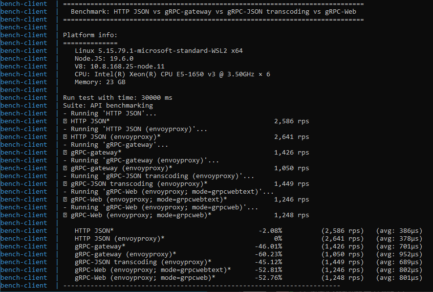

# Evaluating Performance of HTTP JSON vs gRPC-gateway vs gRPC-JSON transcoding vs gRPC-Web

## Requirements

- Docker
- docker-compose

## Description

Using nodejs client and `benchmarkify` lib to benchmark.

## Run test

Steps:

  1. Start backend and gateways:
  
      ```sh
      docker-compose -f docker-compose-backend.yaml up --build
      ```
  1. Wait services is started successfully
  1. Configure test time by edit *BENCHMARK_TIME* in `docker-compose-client.yaml`.
  1. Start client
  
      ```sh
      docker-compose -f docker-compose-client.yaml up --build
      ```
  
## Results



## References

More detail in [medium](https://medium.com/@thinhda/compare-grpc-web-with-grpc-gateway-fa1e2acdf29f?source=activity---post_recommended)
